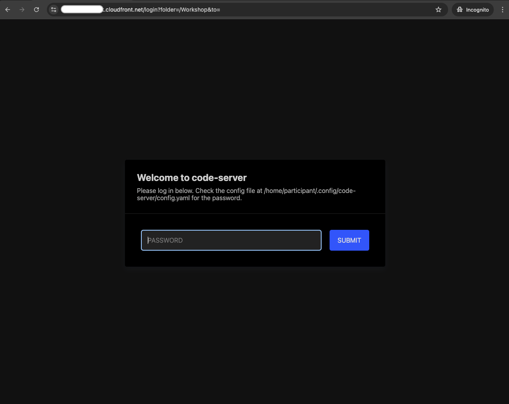
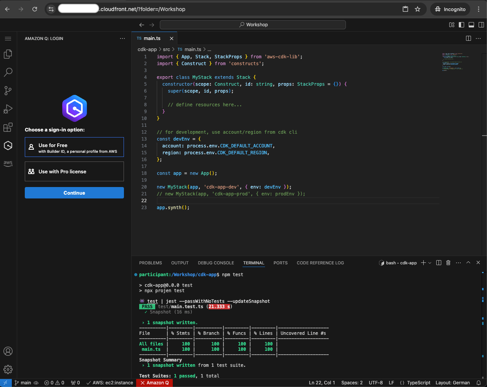
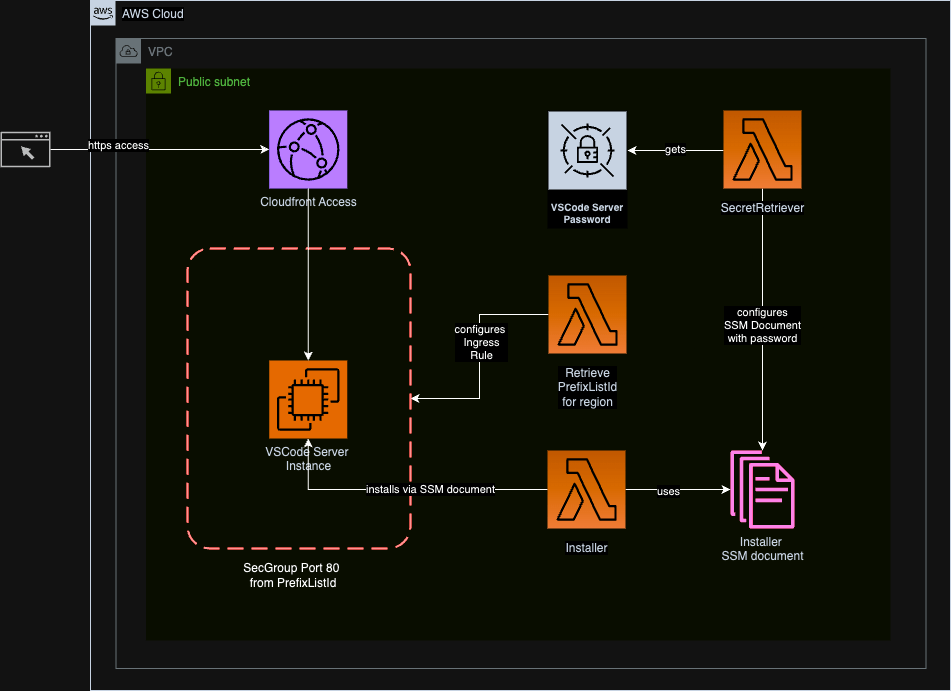

[](https://github.com/MV-Consulting/cdk-vscode-server/actions/workflows/build.yml)
[](https://eslint.org)
[](https://github.com/MV-Consulting/cdk-vscode-server/releases)

[](https://www.npmjs.com/package/@mavogel/cdk-vscode-server)

# cdk-vscode-server

Running your dev IDE vscode on AWS for development and workshop purposes.

> [!Note]
> This construct is designed for workshop purposes and does not fulfill all security and authentication best practices.

**<br>This is an early version of the package. The API will change while I
we implement new features. Therefore make sure you use an exact version in your `package.json` before it reaches 1.0.0.**

## Table of Contents

- [Features](#features)
- [Usage](#usage)
- [Solution Design](#solution-design)
- [Inspiration](#inspiration)

## Features

- ⚡ **Quick Setup**: Spin up and configure your [vscode](https://code.visualstudio.com/) server in under 10 minutes in your AWS account
- 📏 **Best Practice Setup**: Set up with [projen](https://projen.io/) and a [single configuration file](./.projenrc.ts) to keep your changes centralized.
- 🤹‍♂️ **Pre-installed packages**: Besides the [vscode](https://code.visualstudio.com/) server, other tools and software packages such as `git`, `docker`, `awscli` `nodejs` and `python` are pre-installed on the EC2 instance.
- 🏗️ **Extensibility**: Pass in properties to the construct, which start with `additional*`. They allow you to extend the configuration to your needs. There are more to come...

## Usage
The following steps get you started:

1. Create a new `awscdk-app` via
```bash
npx projen new awscdk-app-ts --package-manager=npm
```
3. Add `@mavogel/cdk-vscode-server` as a dependency to your project in the `.projenrc.ts` file
4. Run `yarn run projen` to install it
5. Add the following to the `src/main.ts` file:
```ts
import { App, Stack, StackProps } from 'aws-cdk-lib';
import * as ec2 from 'aws-cdk-lib/aws-ec2';
import * as iam from 'aws-cdk-lib/aws-iam';
import { Construct } from 'constructs';
import { 
  LinuxArchitectureType, 
  LinuxFlavorType, 
  VSCodeServer
} from '@mavogel/cdk-vscode-server';

export class MyStack extends Stack {
  constructor(scope: Construct, id: string, props: StackProps = {}) {
    super(scope, id, props);

    new VSCodeServer(this, 'vscode', {
      // for example (or simply use the defaults by not setting the properties)
      instanceVolumeSize: 8,
      instanceClass: ec2.InstanceClass.M7G,
      instanceSize: ec2.InstanceSize.LARGE,
      instanceOperatingSystem: LinuxFlavorType.UBUNTU_22,
      instanceCpuArchitecture: LinuxArchitectureType.ARM,
      
      // 👇🏽 or if you want to give the InstanceRole more permissions
      additionalInstanceRolePolicies: [
        new iam.PolicyStatement({
          effect: iam.Effect.ALLOW,
          actions: [
            'codebuild:*',
          ],
          resources: [
            `arn:aws:codebuild:*:${Stack.of(this).account}:*/*`,
          ],
        }),
      ]
      
      // and more... 💡
    });
  }
}

const env = {
  account: '123456789912',
  region: 'eu-central-1',
};

const app = new App();
new MyStack(app, 'vscode-server', { env });
app.synth();
```

and deploy it
```bash
npx projen build
npx projen deploy
```

with the output
```console
✨  Deployment time: 509.87s

Outputs:
dev.vscodedomainName6729AA39 = https://d1foo65bar4baz.cloudfront.net/?folder=/Workshop
dev.vscodepassword64FBCA12 = foobarbaz
```

> [!Important]
> There are issues with copy pasting into the VSCode terminal within the Firefox browser (2025-01-12)

Then open the domain name in your favorite browser and you'd see the following login screen:


After entering the password, you are logged into VSCode and can start coding :tada:



## Solution Design

<details>
  <summary>... if you're curious about click here for the details</summary>



</details>

## Inspiration
This project was created based on the following inspiration

- [vscode-on-ec2-for-prototyping](https://github.com/aws-samples/vscode-on-ec2-for-prototyping): as baseline, which unfortunately was outdated
- [aws-terraform-dev-container](https://github.com/awslabs/aws-terraform-dev-container): as baseline for terraform, but unfortunately also outdated
- [java-on-aws-workshop-ide-only.yaml](https://github.com/aws-samples/java-on-aws/blob/main/labs/unicorn-store/infrastructure/cfn/java-on-aws-workshop-ide-only.yaml): an already synthesized cloudformation stack, which used mostly python as the custom resources
- [fleet-workshop-team-stack-self.json](https://static.us-east-1.prod.workshops.aws/public/cc4aa67e-5b7a-4df1-abf7-c42502899a25/assets/fleet-workshop-team-stack-self.json): also an already synthesized cloudformation stack, which did much more as I currently implemented here. 
- [eks-workshop-vscode-cfn.yaml](https://github.com/aws-samples/eks-workshop-v2/blob/main/lab/cfn/eks-workshop-vscode-cfn.yaml): another great baseline

## Unlock the full potential of your AWS cloud infrastructure - Work with us!

> [!TIP]
> Bring your AWS Infrastructure with [MV Consulting](https://manuel-vogel.de/) to a new level. Let's raise your bar! We ship well-architected, resilient, operationally efficient, performance- and cost-optimized AWS solutions. They are designed to scale using Infrastructure as Code (IaC), DevOps best-practices and tailored to cloud-native systems for your businesses.
>
> Our Approach:
>
> - **Tailored AWS Solutions**: Custom-built and adapted for your unique business needs
> - **Future-Proof Architecture**: Scalable designs that grow with you
> - **Cloud-Native in-mind**: Modern and optimized for cloud-native usage
> - **Empowerment Through Ownership**: Your business, your infrastructure, our expertise
>
> Why Choose Us:
> - 7+ Years of AWS Experience
> - 12x AWS Certified, including Solutions Architect & DevOps Engineer Professional
> - 5x Kubernetes Certified with proven deep knowledge and profound hands-on experience
> - Proven Track Record + transparent open source code and Testimonials
> - For us business drives tech and not the other way around
>
> Ready to elevate your AWS Infrastructure?
>
> <a href="https://manuel-vogel.de/contact"></a>
> <details><summary>☁️ <strong>Discover more about my one-person business: MV Consulting</strong></summary>
>
> <br/>
>
> Hi, I'm Manuel – AWS expert and founder of [MV Consulting](https://manuel-vogel.de). With over a decade of hands-on experience, I specialized myself in deploying well-architected, highly scalable and cost-effective AWS Solutions using Infrastructure as Code (IaC).
>
> #### When you work with me, you're getting a package deal of expertise and personalized service:
>
> - **AWS IaC Proficiency**: I bring deep AWS CDK and [terraform](https://www.terraform.io/) knowledge to the table, ensuring your infrastructure is not just maintainable and scalable, but also fully automated.
> - **AWS Certified**: [Equipped with 12 AWS Certifications](https://www.credly.com/users/manuel-vogel/badges), including Solutions Architect & DevOps Engineer Professional, to ensure best practices across diverse cloud scenarios.
> - **Direct Access**: You work with me, not a team of managers. Expect quick decisions and high-quality work.
> - **Tailored Solutions**: Understanding that no two businesses are alike, I Custom-fit cloud infrastructure for your unique needs.
> - **Cost-Effective**: I'll optimize your AWS spending without cutting corners on performance or security.
> - **Seamless CI/CD**: I'll set up smooth CI/CD processes using GitHub Actions or Gitlab CI, making changes a breeze through Pull Requests.
>
> *My mission is clear: I'll free you from infrastructure and automation headaches so you can focus on what truly matters – your core business.*
>
> Ready to unlock the full potential of the AWS Cloud?
>
> <a href="https://manuel-vogel.de/contact"></a>
> </details>

## Acknowledgements

Big thank you to the creators of [projen](https://github.com/projen/projen). This project stands on the shoulders of giants, made possible by their pioneering work in simplifying cloud infrastructure projects!

## Author

[Manuel Vogel](https://manuel-vogel.de/about/)

[](https://www.linkedin.com/in/manuel-vogel)
[](https://github.com/mavogel)